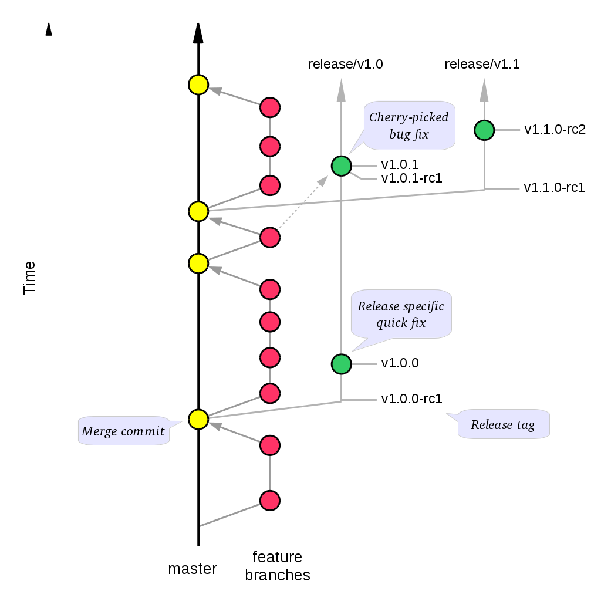

=====================
Git Development Guide
=====================

Introduction
============

This guide, designed for a National Library of New Zealand (NLNZ) (https://natlib.govt.nz/) developer and contributor,
covers how to use git for development of NLNZ software projects.

Contents of this document
-------------------------

Following this introduction, the Git Development Guide includes the following sections:

-   **Git Workflow** - Covers the git workflow.

Git Workflow
============

This workflow is a hybrid of several popular git workflows (Github Flow, Atlassian Simple Git, Cactus Model,
Stable Mainline Model), designed to fit the needs of the NLNZ development. It will use a shared
repository model via Github using the given Github software repository.

Commit Messages
---------------

Prefix commit messages with a ticket number (when applicable). This information comes in handy when reviewing git
history, or when cherry-picking individual commits (e.g. when cherry-picking a bug-fix commit from master into a release
branch, the resulting history will be more informative).

TODO Consider more detail in the commit message, limiting line length.

Commit message example
~~~~~~~~~~~~~~~~~~~~~~
::

    D1.1: Add a unit test for dynamic reflow

Master Branch
-------------

The master branch is the default development branch for this project. For most purposes, the master branch is considered
stable. In other words, if you check out the master branch you can expect that:

-   It builds on all supported platforms/targets.

-   All unit tests pass (as well as static tests, linter checks and the like).

-   A “standard run” of dependent software works.

However, the master branch might not pass a comprehensive QA test at all times.

Feature Development
-------------------

Feature branch purpose
~~~~~~~~~~~~~~~~~~~~~~

All development is done in dedicated (relatively short lived) feature branches. This is where most of the action takes
place, including:

-   Feature development.

-   Code review.

-   Integration testing (if any).

A feature branch branches off from master, and once development is finished and all the integration criteria have been
met, code review completed, it is merged back to the master branch using a pull request.

|diagramFeaturesGoingIntoMasterBranch|

Feature branch naming
~~~~~~~~~~~~~~~~~~~~~

This project will use the following convention for naming feature branches:
::

    “feature/<ticket>_description_separated_by_underscores”

where ticket is a reference to the corresponding ticket in the project issue tracker (or work plan), and description is
a very short description (up to five words or so) of the purpose of the branch.

Feature branch naming example:
::

    feature/D1.1_new_harvestagent_h3_impl

If a feature branch is running for an extended period of time, consider breaking the issue/story into smaller components
that can be integrated more frequently with the master branch.

Updating Feature Branches
~~~~~~~~~~~~~~~~~~~~~~~~~

To keep feature branches up to date with changes in the master branch, it is a good idea to rebase regularly from master
to minimize merge conflicts later on when it is time for a feature to be merged back into master.

To update feature branches use merging.

Checking out a branch example:
::

    git checkout feature_branch
    git pull origin master

Reasons for using ‘Always Merge’ convention
~~~~~~~~~~~~~~~~~~~~~~~~~~~~~~~~~~~~~~~~~~~

-   Pull Requests won’t contain rebased commits from master that have already been reviewed. You will just see the
    changes relating to the feature branch.

-   Merging changes from master, ‘rework’ commits, should mean you will only need to fix merge conflicts once. Whereas
    merge conflicts need to be resolved every time a rebase is done.

-   Rebasing can be dangerous when used on shared remote branches, as the history of the branch is being rewritten.

-   No need to worry about using force push for a branch that has been rebased.

-   Rebasing is generally considered a complex and advanced feature of git. In order to make it easier for the community
    to engage with software developement, it would be wise to keep the project workflow as simple as possible.

Code Review and Pull Requests
-----------------------------

Pull Requests are to be used to initiate code reviews and discussions about the code implementation in a dedicated
branch that does not interfere with the main development branch. This review/testing can done at any stage in the
development of that branch. As a rule, all feature branches must be peer reviewed via Github before being merged into
the master branch.

Sharing a feature branch remotely
~~~~~~~~~~~~~~~~~~~~~~~~~~~~~~~~~

1.  Ensure your feature branch is up to date with latest changes from master.

2.  Push the latest commit from your feature branch to the shared github repository.

3.  Fetch remote feature branch into local repository.

Initiating a code review via Github
~~~~~~~~~~~~~~~~~~~~~~~~~~~~~~~~~~~

1.  Ensure your feature branch is up to date with latest changes from master.

2.  Push the latest commit from your feature branch to the shared github repository.

3.  Navigate to that branch in Github, and open a Pull Request.

4.  Use WIP if not ready to be merged into master.

5.  Use assigning and mentions to ensure the right people are notified of the Pull Request.

After the initial push of a feature branch you can keep pushing updates to the remote branch multiple times throughout.
This can happen in response to feedback, or because you’re not done with the development of the feature.

Merging into Master
-------------------

Merging feature branches into master will use the no fast forward method. This forces the creation of merge commits to
preserve the notion of the feature branches in the git history, and also makes it easier to revert a merge if
necessary.

TODO Shouldn't all merges to Master be done via Github pull request? In fact, the Github master branch should be locked
down so that merges are done ONLY by pull request.
::

    git checkout master
    git merge --no-ff branch

Example of merging with fast forward:
::

    git merge --no-ff feature/DX.Y_desc

If merging a major feature that includes a large number of commits then add the `--log` flag to the merge command to
include a brief description of the commits that were merged.

Example of merging with log flag:
::

    git merge --no-ff --log feature/DX.Y_desc

Releases
--------

Release branch criteria
~~~~~~~~~~~~~~~~~~~~~~~

This project will use release branches and tags to designate releases. Once it has been decided what version number to
use and what commit to base a release on, a new release branch is created from the selected commit, and it is never
merged back into master.

|diagramMasterAndFeatureBranches|

Changes to the release branch
~~~~~~~~~~~~~~~~~~~~~~~~~~~~~

After a release branch is announced, only serious bug fixes are included in the release branch. If possible these bug
fixes are first merged into master and then cherry-picked into the release branch. This way you can't forget to
cherry-pick them into master and encounter the same bug on subsequent releases.

Release branch naming
~~~~~~~~~~~~~~~~~~~~~

Given a regular major.minor.patch version numbering scheme (e.g. semantic versioning), a release branch should be named
`release/vX.Y`, where `X` is the major version number and `Y` is the minor version number.

Example of release branch naming:
::

    release/v1.3

Git release tags
~~~~~~~~~~~~~~~~

In addition to release branches, release tags are created for each actual release (this may include release candidates
that are intended for QA or beta testing, as well as public releases). The release tags are made in the corresponding
release branch.

The commit that represents a specific release is tagged with a tag named `vX.Y.Z`, optionally suffixed with a textual
identifier, such as `-alpha`, `beta`, `-rc1`.

Example of release tag:
::

    v1.3.2-rc1

Patch versions
~~~~~~~~~~~~~~

The first release version from the `vX.Y` release branch, is tagged with the patch version `0`, eg. `vX.Y.0`. Every time
a bug-fix is included in a release branch the patch version is raised (to comply with Semantic Versioning) by setting a
new tag.

When no more bugs are found, tag the tip of the release branch with `vX.Y.Z` (it is no longer a release candidate), and
if necessary make a final build (e.g. to get the release number correct in the release package etc).

Continuous Integration (placeholder)
------------------------------------

TODO Write notes and instructions for continuous integration.

.. |diagramFeaturesGoingIntoMasterBranch| image:: ../_static/git-development-guide/diagram-features-going-into-master-branch.png
   :width: 242.13px
   :height: 296.50px

